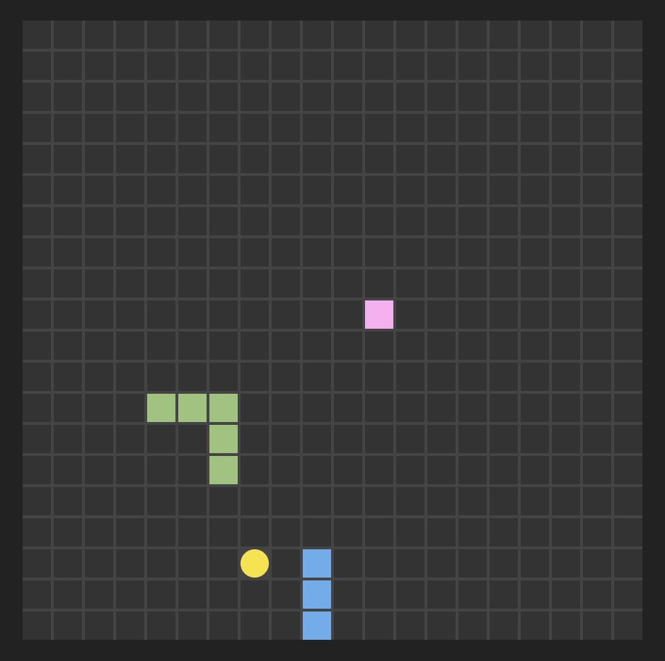

# Snex

Snex is a real-time multiplayer Snake game built with Elixir. Players share a game board, collect dots to grow their snakes, and avoid collisions with themselves and others. The game features wraparound movement and fun mechanics like shrinking on collision instead of instant elimination.



## How to Download and Run

### Prerequisites

- Elixir (version 1.17 or later recommended)

### Steps

<ol><li>
Clone the repository:<br>

```bash
git clone https://github.com/yourusername/snex.git
cd snex
```
</li>
<li>Install dependencies:

```bash
mix deps.get
```
</li>
<li>Start the Phoenix server:

```bash
mix phx.server
```
</li>

<li>Open your browser and navigate to: <a href="http://localhost:4000">http://localhost:4000</a></li>

<li>Share the URL with friends, and they can join your game by visiting the same board ID.
</li>
</ol>
